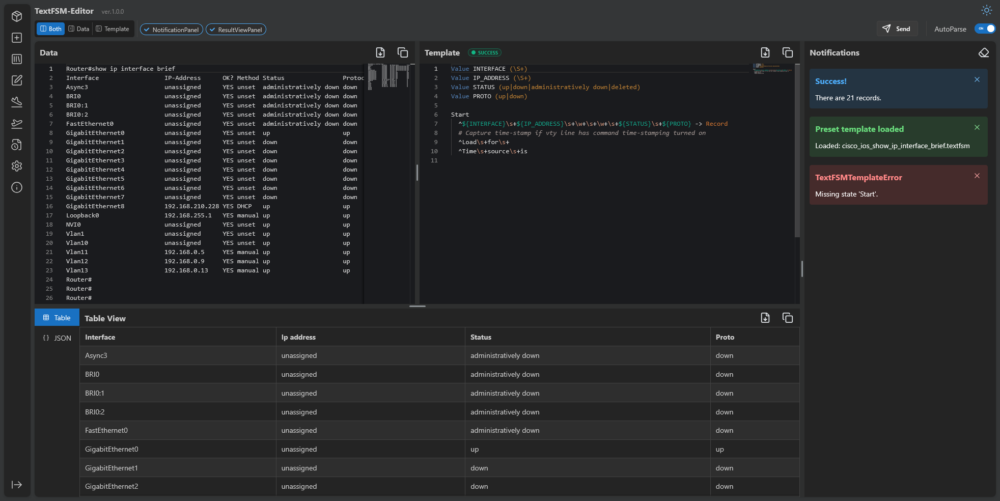
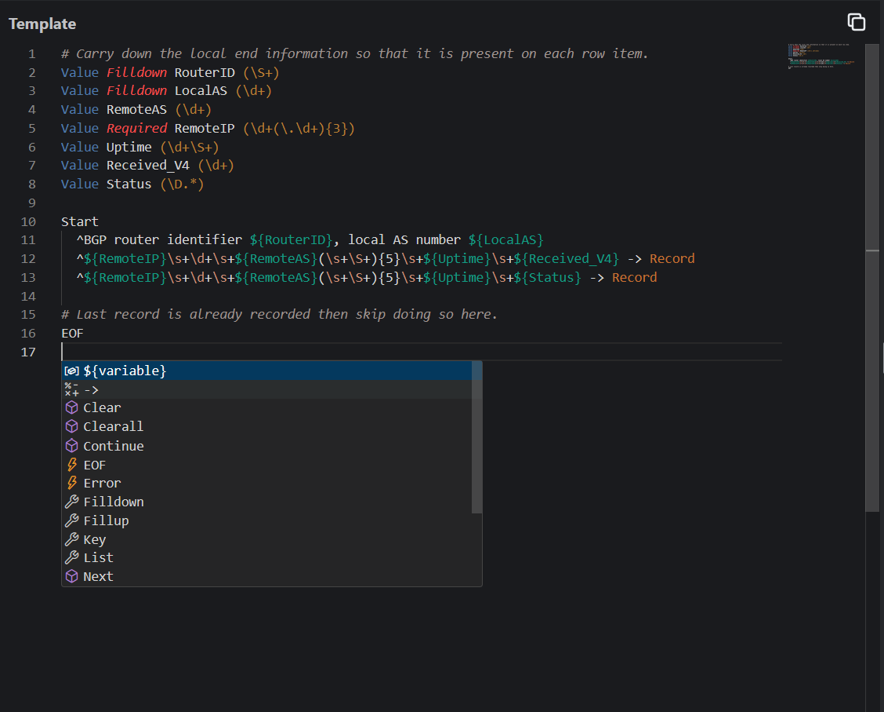
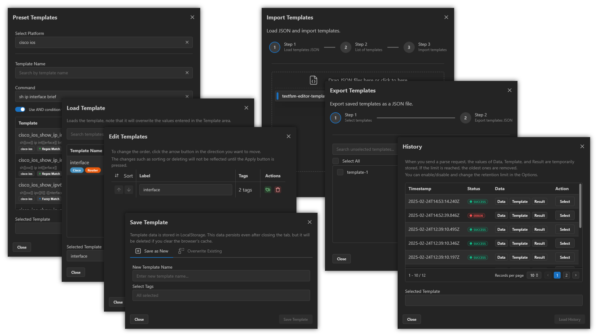

<p align="center">
  <a href="https://github.com/yuyosy/textfsm-editor.react.web" target="_blank" rel="noopener noreferrer">
    
  </a>
</p>

# TextFSM Editor

ネットワークエンジニアや開発者が TextFSM テンプレートを効率的に作成・テストできる、リアルタイム解析機能を備えた Web ベースのTextFSMエディタです。

English version: [English README](README.md)

> [!NOTE]
>
> 本プロジェクトは現在開発中です。  
> 一部のコードは非効率な実装の場合があります。  
> セキュリティ上の考慮が十分でない可能性があります。  
> 本ドキュメントは作業途中のため、不完全または不正確な部分があるかもしれません。



## 機能

### エディタ機能

- 🎨 インターフェーステーマ  
  - ライトモードとダークモードのサポート
- 📝 高度なエディタ統合 (Monaco Editor)  
  - TextFSM の構文ハイライト
  - 単語補完
  - コードの折りたたみとミニマップナビゲーション
- 📄 ファイルダウンロード  
  - 入力データおよび結果データのファイル出力
- 📋 クリップボード連携  
  - ワンクリックコピー機能

### パース機能

- ⚡ リアルタイムでのテンプレート適用
  - 変更に対する即時フィードバック
  - エラー検出機能
- 🔍 複数のデータ表示オプション  
  - テーブル表示による構造化データの確認
  - JSON 表示によるプログラム的アクセス
- 🕰️ パースの履歴  
  - 入力値、テンプレート、結果を一時的に LocalStorage に保存

### テンプレート管理

- 🗃️ プリセット読み込み  
  - NTC Templates からのテンプレート読み込み
  - 正規表現やあいまい検索によるテンプレート検索
- 🗂️ テンプレート管理  
  - LocalStorage へのテンプレート保存・読み込み
- 🖇️ インポート／エクスポート  
  - ファイルからのテンプレート読み込み
  - ファイルへのテンプレート出力

テーマ機能


シンタックスハイライトと補完機能


パースしたデータのテーブル形式での表示


パースしたデータのJSON形式での表示


その他エディタの機能


## プロジェクト構成

```
textfsm-editor.react.web/
├ Frontend/                                # React フロントエンドアプリケーション
│   ├ src/                                  # ソースコード
│   ├ package.json                          # フロントエンドのプロジェクト情報と依存関係
│   └ ***                                   # その他のフロントエンドファイル
├ Backend/                                 # Python バックエンドアプリケーション
│   ├ src/                                  # ソースコード
│   ├ pyproject.toml                        # バックエンドのプロジェクト情報と依存関係
│   └ ***                                   # その他のバックエンドファイル
├ textfsm-editor.react.web.code-workspace  # VSCode ワークスペースファイル
├ README.md                                # 英語版 README
├ README.ja.md                             # このファイル
└ ***                                      # その他のワークスペースファイル
```

VSCodeで textfsm-editor.react.web.code-workspace ファイルを開いて、ワークスペース全体を読み込みます。

## 始め方

- 基本的なNode.jsとPython環境で実行  
  - Dockerを使わずに Node.js と Python を使用して実行する
  - 初期環境設定手順については「[基本的なNode.jsとPython環境での始め方](#基本的なnodejsとpython環境での始め方)」を参照してください。
- Docker Compose の利用  
  - Docker Compose による起動方法については「[Docker Compose環境での始め方](#docker-compose環境での始め方)」を参照してください。


### 備考

このソフトウェアは、外部 CDN である jsDelivr から Monaco Editor (Microsoft) を読み込みます。
- https://www.jsdelivr.com/package/npm/monaco-editor


## 基本的なNode.jsとPython環境での始め方

### 前提条件

- Node.js (v16以上)
- npm
- Python (v3.8以上)
- uv (推奨)

### インストール

1. リポジトリをクローン

```bash
git clone https://github.com/yourusername/textfsm-editor.react.web.git
cd textfsm-editor.react.web
```

2. Frontend のセットアップ

```bash
# run command in the project root directory
cd frontend
npm install
```

3. Backend のセットアップ

```bash
# run command in the project root directory
cd backend
uv sync
```

### 開発

フロントエンドとバックエンドは別々のターミナルで実行してください。

1. Frontend の起動

```bash
# run command in the project root directory
cd frontend
npm run dev
```

※ 起動時にポート番号を変更する場合は、`--port` オプションを使用してください。

2. Backend の起動

```bash
# run command in the project root directory
cd backend
uv run uvicorn src.main:app --reload
```

※ 起動時にポート番号を変更する場合は、`--port` オプションを使用してください。

3. 各サービスへのアクセス  
- フロントエンド: http://localhost:5173  
- バックエンド: http://localhost:8000

### 本番環境

TODO

## Docker Compose環境での始め方

### 前提条件

- Docker
- Docker Compose

### インストール

1. リポジトリをクローン

```bash
git clone https://github.com/yourusername/textfsm-editor.react.web.git
cd textfsm-editor.react.web
```

2. コンテナのビルド

```bash
docker compose build
```

### 開発用

1. コンテナの起動

```bash
docker compose --profile dev up --build --watch
```

### 本番環境（実験的）

1. コンテナの起動

```bash
docker compose --profile prod up --build
```

## Contributing

大歓迎です! 気軽にプルリクエストを送信してください。

1. リポジトリをフォークします
2. 機能ブランチを作成します (`git checkout -b feature/AmazingFeature`)
3. 変更をコミットします (`git commit -m 'Add some AmazingFeature'`)
4. ブランチにプッシュします (`git push origin feature/AmazingFeature`)
5. プルリクエストを開きます

## License

MIT License Copyright (c) 2023 yuyosy


## References

- [GitHub - microsoft/monaco-editor](https://github.com/microsoft/monaco-editor)
- [React](https://react.dev)
- [Vite](https://vitejs.dev)
