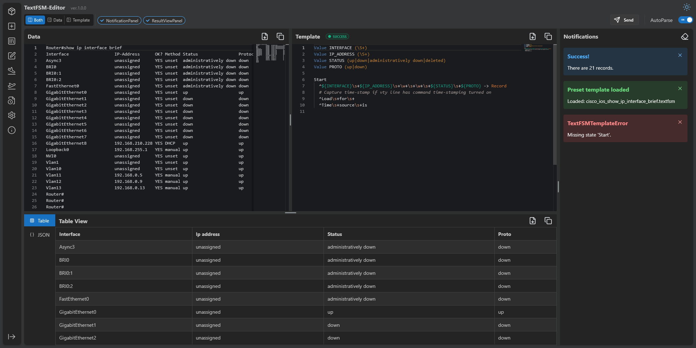
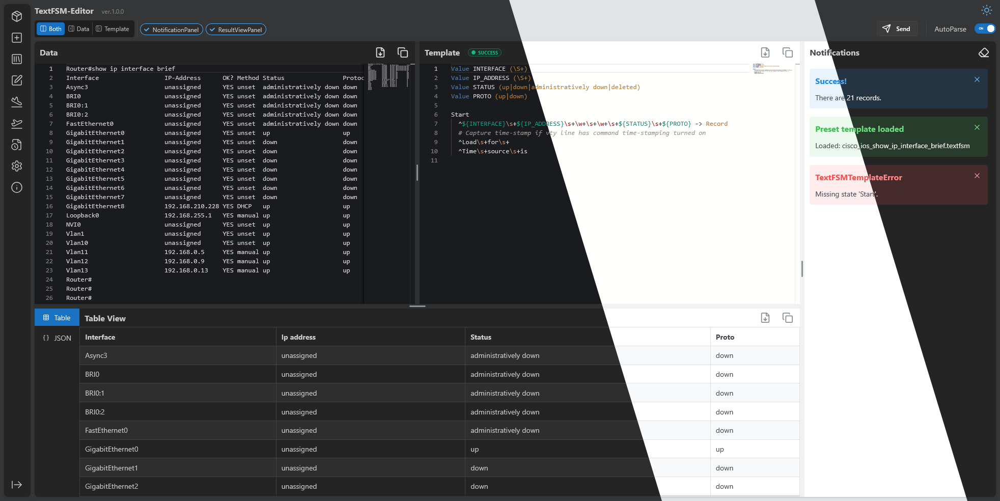
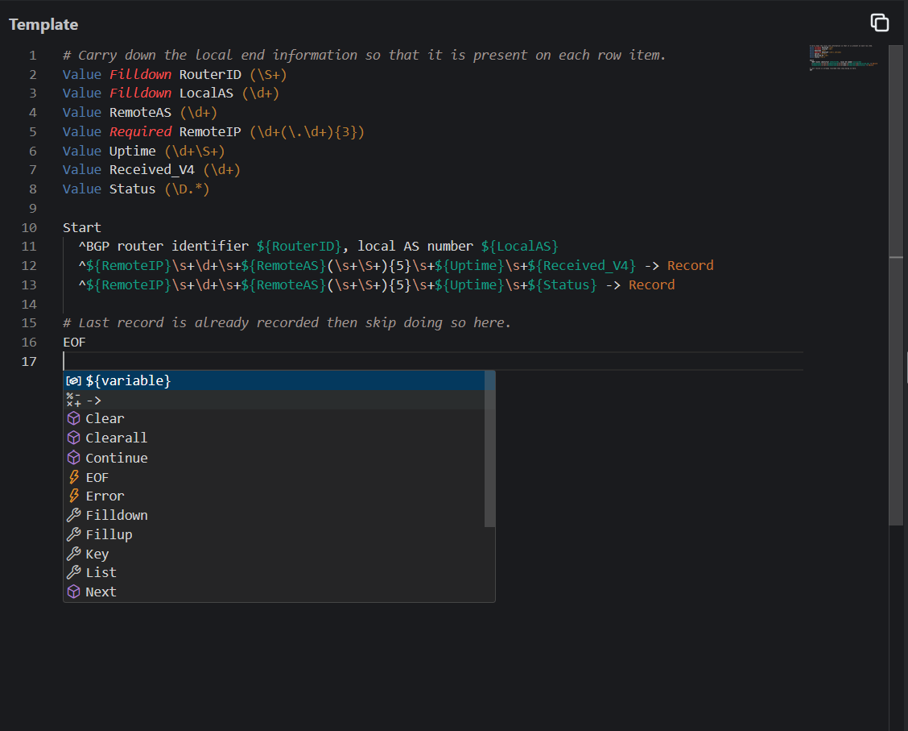
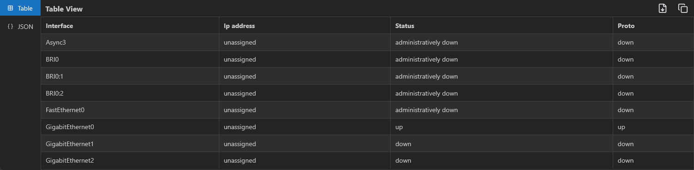
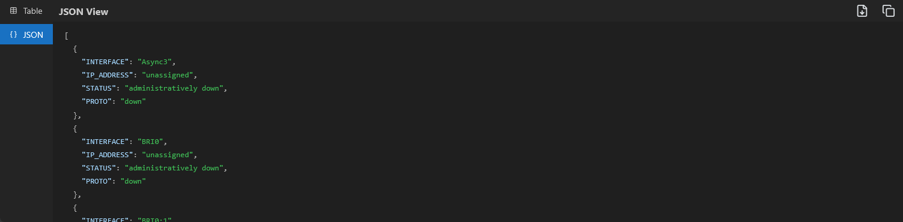
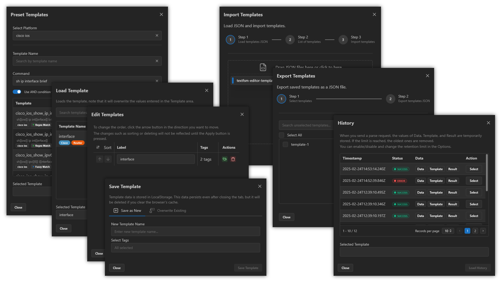

<p align="center">
  <a href="https://github.com/yuyosy/textfsm-editor.react.web" target="_blank" rel="noopener noreferrer">
    
  </a>
</p>

# TextFSM Editor

A web-based editor for TextFSM templates with real-time parsing capabilities. This tool enables network engineers and developers to efficiently create and test TextFSM templates with instant feedback.

日本語版こちら: [Japanese README](README.ja.md)

> [!NOTE]
>
> This project is currently under development.
> Some parts of the code may be inefficient.
> Security considerations may be insufficient.
> This documentation is a work in progress and may be incomplete or inaccurate.



## Features

### Editor Features

- 🎨 Interface Themes
  - Light and Dark mode support
- 📝 Advanced Editor Integration (Monaco Editor)
  - TextFSM syntax highlighting
  - Intelligent word suggestions and auto-completion
  - Code folding and minimap navigation
- 📄 Downloads Files
  - Supports downloading entered data and result data as files
- 📋 Clipboard Integration
  - Quick copy support

### Parsing Features

- ⚡ Real-time Template Parsing
  - Instant feedback on template changes
  - Error detection
- 🔍 Multiple Data View Options
  - Table view for structured data representation
  - JSON view for programmatic access
- 🕰️ Parsing history
  - The values of Data, Template, and Result are temporarily stored in LocalStorage

### Template Management
- 🗃️ Presets
  - Load template from NTC Templates
  - Template search using regular expressions, fuzzy search
- 🗂️ Template Management
  - Save templates to LocalStorage
  - Load existing templates
- 🖇️ Import/Export Capabilities
  - Import templates from files
  - Export templates to files

Interface theme


Word suggestion and syntax highlighting


Table display of parsed data


JSON display of parsed data


Editor's useful features


## Project Structure


```
textfsm-editor.react.web/
├ Frontend/                                # React frontend application
│   ├ src/                                  # Source files
│   ├ package.json                          # Frontend project information and dependencies
│   └ ***                                   # Frontend other files
├ Backend/                                 # Python backend application
│   ├ src/                                  # Source files
│   ├ pyproject.toml                        # Backend project information and dependencies
│   └ ***                                   # Backend other files
├ textfsm-editor.react.web.code-workspace  # VSCode workspace file
├ README.md                                # This file
└ ***                                      # Workspace other files
```

Open the `textfsm-editor.react.web.code-workspace` file with VSCode to open the workspace.

## Getting Started
- Using the Primitive Environment
  - Run Node.js and Python without Docker.
  - Follow the installation instructions for the primitive environment: [Getting Started with the Primitive Environment](#getting-started-with-the-primitive-environment)
- Using Docker Compose
  - Follow the installation instructions for Docker Compose: [Getting Started with Docker Compose](#getting-started-with-docker-compose)

### Notice

This software loads Monaco Editor (Microsoft) from jsDelivr, an external CDN.
- https://www.jsdelivr.com/package/npm/monaco-editor


### Getting Started with the Primitive Environment

#### Prerequisites

- Node.js (v16 or higher)
- npm
- Python (v3.8 or higher)
- uv (recommended for Python environment)

#### Installation

1. Clone the repository:

```bash
git clone https://github.com/yourusername/textfsm-editor.react.web.git
cd textfsm-editor.react.web
```

2. Setup Frontend

```bash
# run command in the project root directory
cd frontend
npm install
```

3. Setup Backend

```bash
# run command in the project root directory
cd backend
uv sync
```

#### Development

The frontend and backend must be run separately. It is recommended to open them in separate terminals.

1. Run Frontend

```bash
# run command in the project root directory
cd frontend
npm run dev
```

Tips: If you want to change the port number at startup, use the --port option.

2. Run Backend

```bash
# run command in the project root directory
cd backend
uv run uvicorn src.main:app --reload
```

Tips: If you want to change the port number at startup, use the --port option.

3. Access the services
   - Frontend Service: `http://localhost:5173`
   - Backend Service: `http://localhost:8000`

#### Production

TODO

### Getting Started with Docker Compose

#### Prerequisites

- Docker
- Docker Compose

#### Installation

1. Clone the repository

```bash
git clone https://github.com/yourusername/textfsm-editor.react.web.git
cd textfsm-editor.react.web
```

2. Build containers

```bash
docker compose build
```

#### Development

1. Start containers
```bash
docker compose --profile dev up --build --watch
```

#### Production (Experimental)

TODO:

1. Start containers
```bash
docker compose --profile prod up --build
```


## Contributing

Contributions are welcome! Please feel free to submit a Pull Request.

1. Fork the repository
2. Create your feature branch (`git checkout -b feature/AmazingFeature`)
3. Commit your changes (`git commit -m 'Add some AmazingFeature'`)
4. Push to the branch (`git push origin feature/AmazingFeature`)
5. Open a Pull Request

## License

MIT License Copyright (c) 2023 yuyosy


## References

- [GitHub - microsoft/monaco-editor](https://github.com/microsoft/monaco-editor)
- [React](https://react.dev)
- [Vite](https://vitejs.dev)
