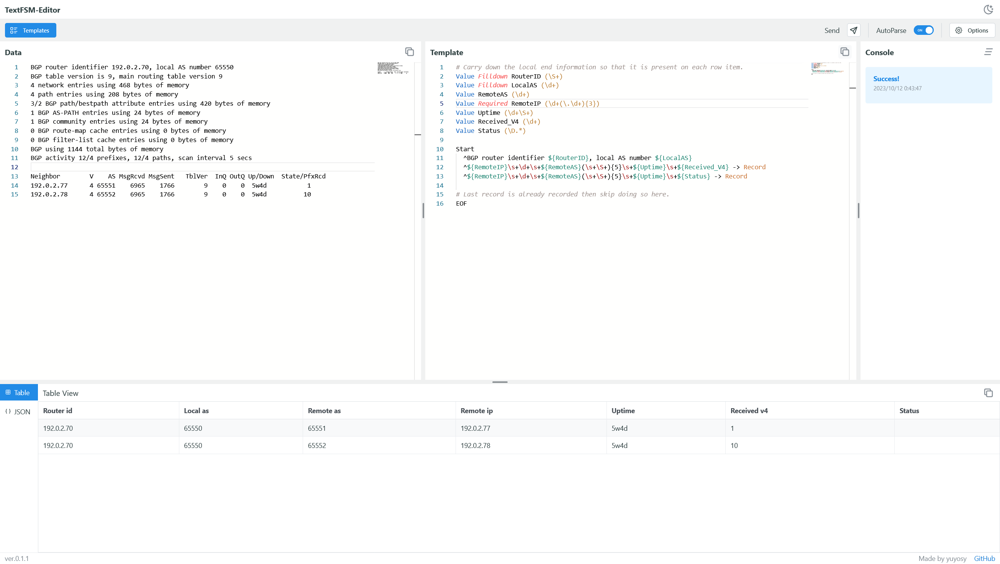
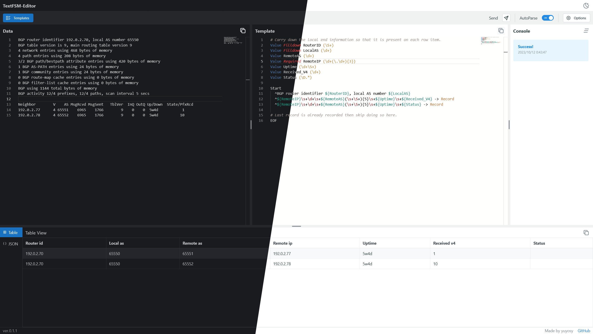
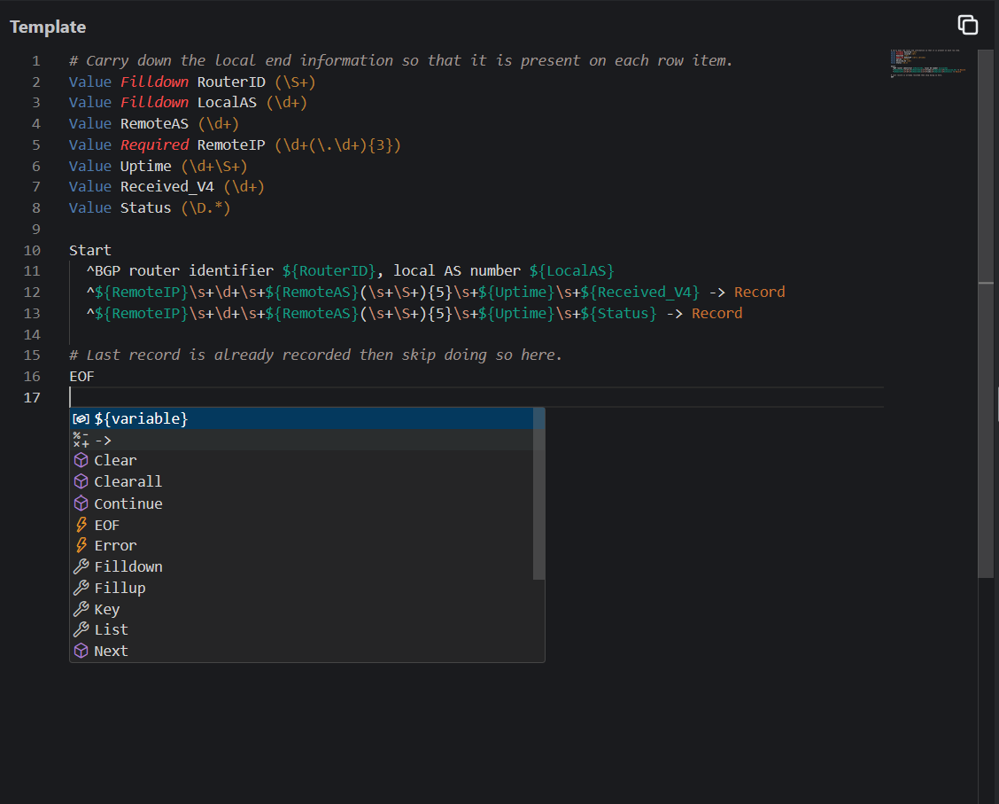
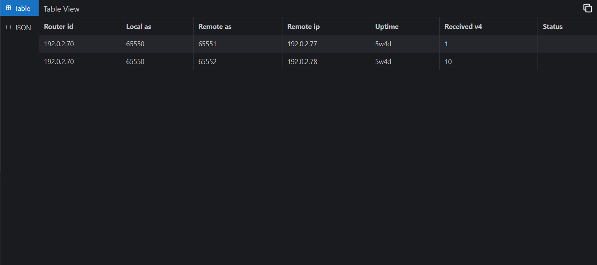
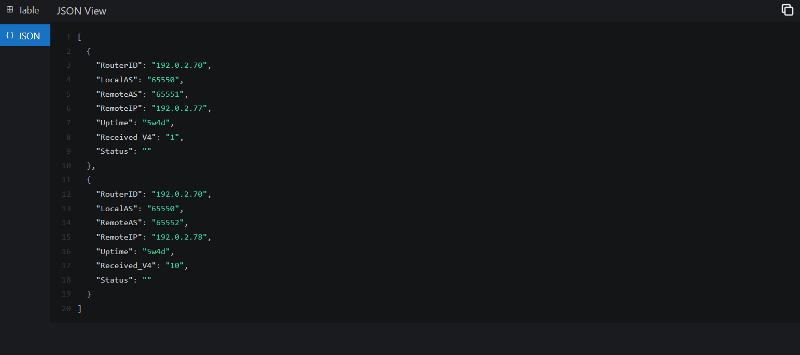

# textfsm-editor.react.web

> ! This project is under development.

> ! This documentation is a work in progress. It may be incomplete or inaccurate.

## Features

- 🎨Interface theme (Light/Dark)
- ⚡Realtime parse
- 📝Integrate monaco editor
  - TextFSM syntax highlighting
  - Word suggestion
  - Minimap
- 🔍Displaying parsed data
  - Table
  - JSON
- 🗂️Save/Load TextFSM template
- 🖇️Import/Export TextFSM template
- 📋Copy to clipboard

Interface theme

Word suggestion and syntax highlighting

Table display of parsed data

JSON display of parsed data

## Usage

TODO

## Development

This project is built using React and Python.

### Requirements

#### Required Environments

- Node.js
- Python

#### Recommended Softwares

Recommended softwares to run this project

- Yarn (Node.js)
- Rye (Python)

## License

MIT License Copyright (c) 2023 yuyosy

## Notice

This project incorporates components from the project below.
monaco-editor is distributed in Copyright (c) 2016 - present Microsoft Corporation (MIT License).

- [monaco-editor](public/libs/monaco-editor) ([MIT License](public/libs/monaco-editor/LICENSE))

## References

- [GitHub - microsoft/monaco-editor](https://github.com/microsoft/monaco-editor)
- [React](https://react.dev)
- [Vite](https://vitejs.dev)
